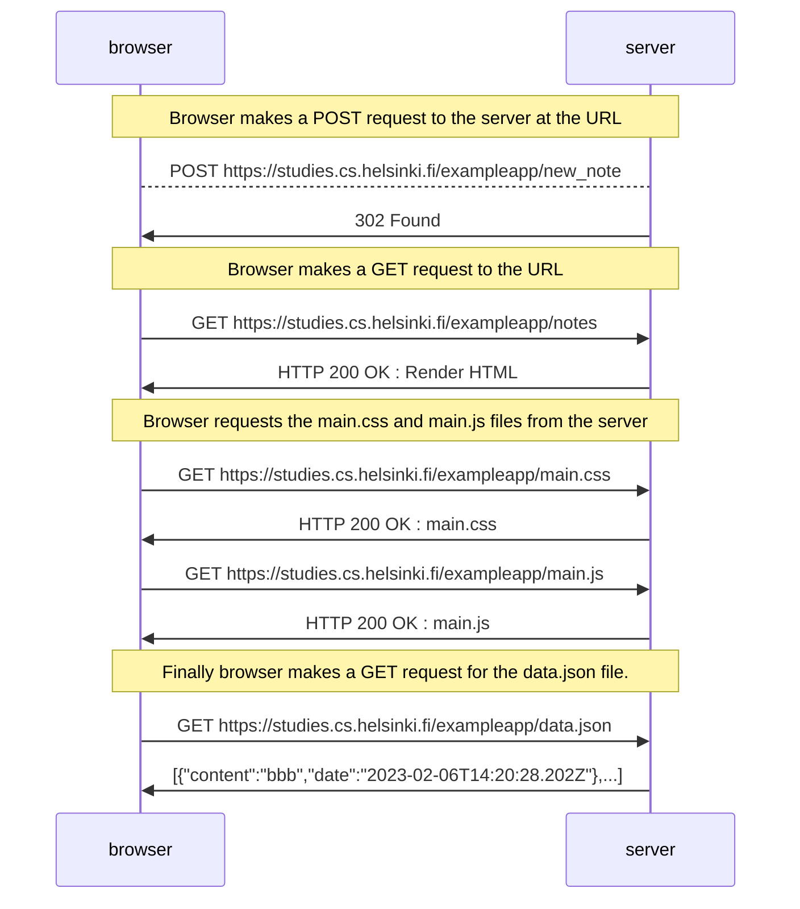

```mermaid
sequenceDiagram
    
    participant browser
    participant server

    note over browser,server: Browser makes a POST request to the server at the URL 
    browser-->server: POST https://studies.cs.helsinki.fi/exampleapp/new_note
    server->>browser: 302 Found 

    note over browser,server: Browser makes a GET request to the URL 
    browser->>server: GET https://studies.cs.helsinki.fi/exampleapp/notes
    server->>browser: HTTP 200 OK : Render HTML

    note over browser,server: Browser requests the main.css and main.js files from the server
    browser->>server: GET https://studies.cs.helsinki.fi/exampleapp/main.css
    server->>browser: HTTP 200 OK : main.css 
    browser->>server: GET https://studies.cs.helsinki.fi/exampleapp/main.js
    server->>browser: HTTP 200 OK : main.js 

    note over browser,server: Finally browser makes a GET request for the data.json file.
    browser->>server: GET https://studies.cs.helsinki.fi/exampleapp/data.json
    server->>browser: [{"content":"bbb","date":"2023-02-06T14:20:28.202Z"},...]
```