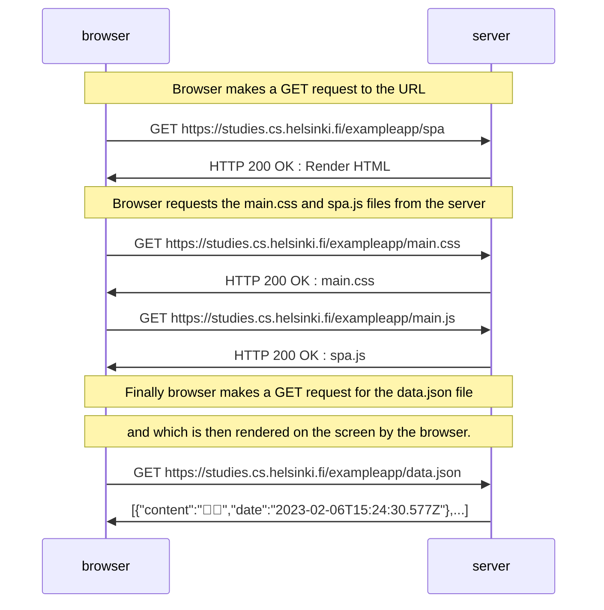

```mermaid
sequenceDiagram
    
    participant browser
    participant server

    note over browser,server: Browser makes a GET request to the URL 
    browser->>server: GET https://studies.cs.helsinki.fi/exampleapp/spa
    server->>browser: HTTP 200 OK : Render HTML

    note over browser,server: Browser requests the main.css and spa.js files from the server
    browser->>server: GET https://studies.cs.helsinki.fi/exampleapp/main.css
    server->>browser: HTTP 200 OK : main.css 
    browser->>server: GET https://studies.cs.helsinki.fi/exampleapp/main.js
    server->>browser: HTTP 200 OK : spa.js 

    note over browser,server: Finally browser makes a GET request for the data.json file
    note over browser,server: and which is then rendered on the screen by the browser.
     
    browser->>server: GET https://studies.cs.helsinki.fi/exampleapp/data.json
    server->>browser: [{"content":"😵‍💫","date":"2023-02-06T15:24:30.577Z"},...]
```